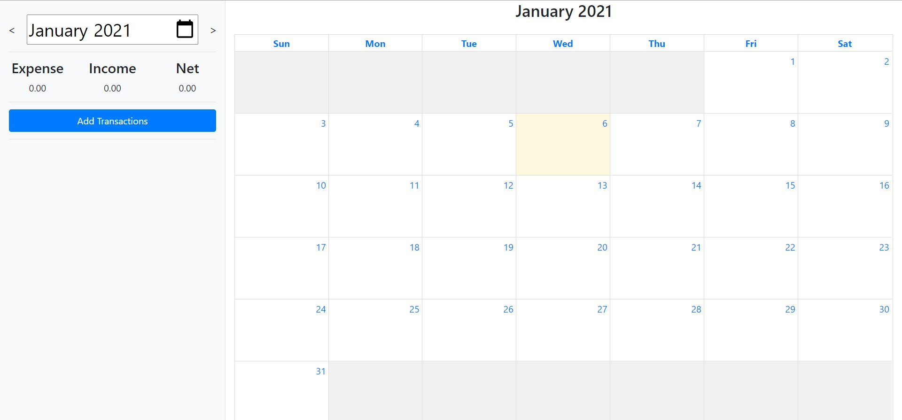
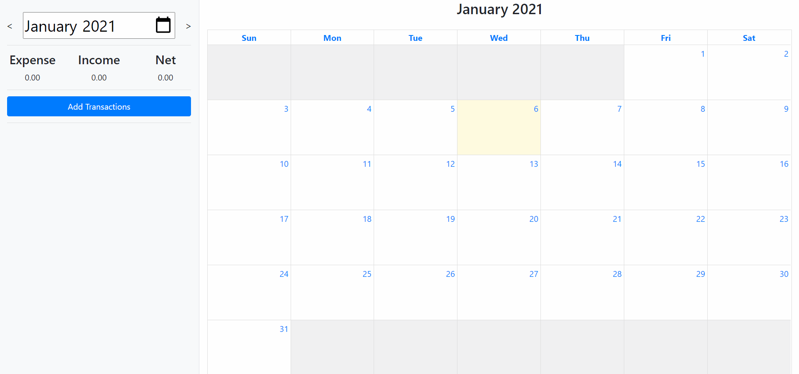
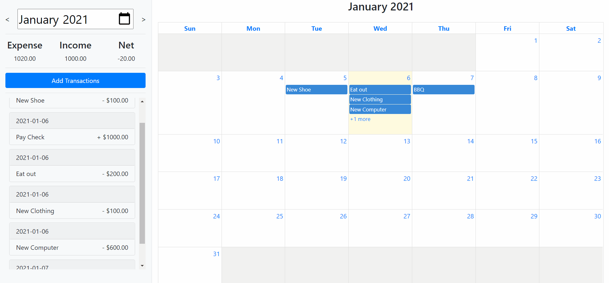
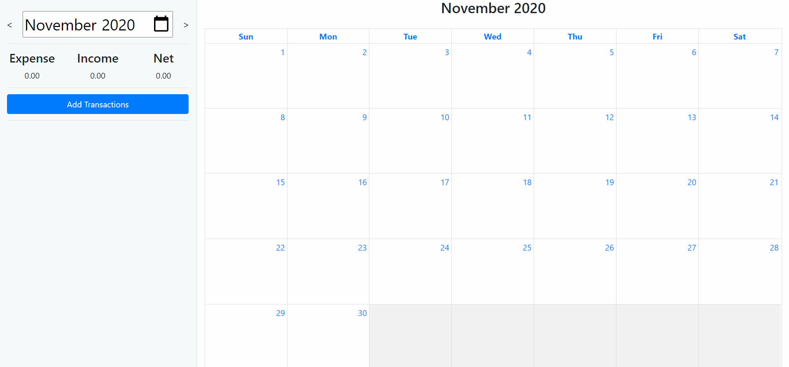

# MoneyManager

A simple web application that allows user to keep track of all expenses and incomes.

## Application

</img>

* Adding new transactions
</img>

* Editing and deleting transactions
</img>

* Changing months
</img>

## Used

* Django
* FullCalendar.js
* Jquery
* Bootstrap
